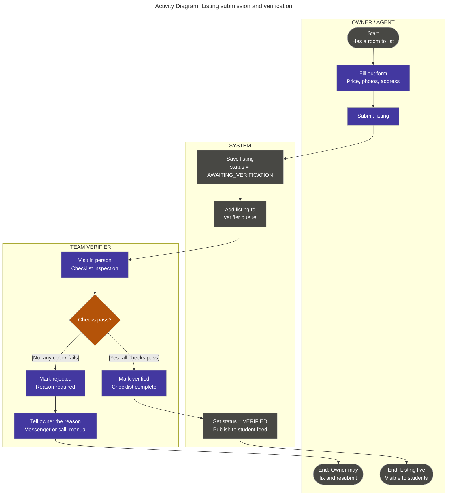

# Activity Diagram — Listing Submission & Verification Workflow

**Scope:** Our core workflow; one swimlane per role and one for the system; every decision labelled with guards; start and end nodes.

**Key:** each outlined box is a swimlane (one role or the system); rounded nodes = start and end; rectangles = actions; diamond = decision, with the guard condition in brackets on each outgoing arrow.

**Traceability:** This is the workflow behind Experiments 1 and 2 on our JVB: a team member personally checks a listing before it reaches students. The "No" branch is our own addition, because our riskiest assumption (#3, owners willing to be verified) is still unvalidated. There is no automatic notification service in our architecture, so the system only queues the listing, and the Verifier tells the owner about a rejection by hand.
