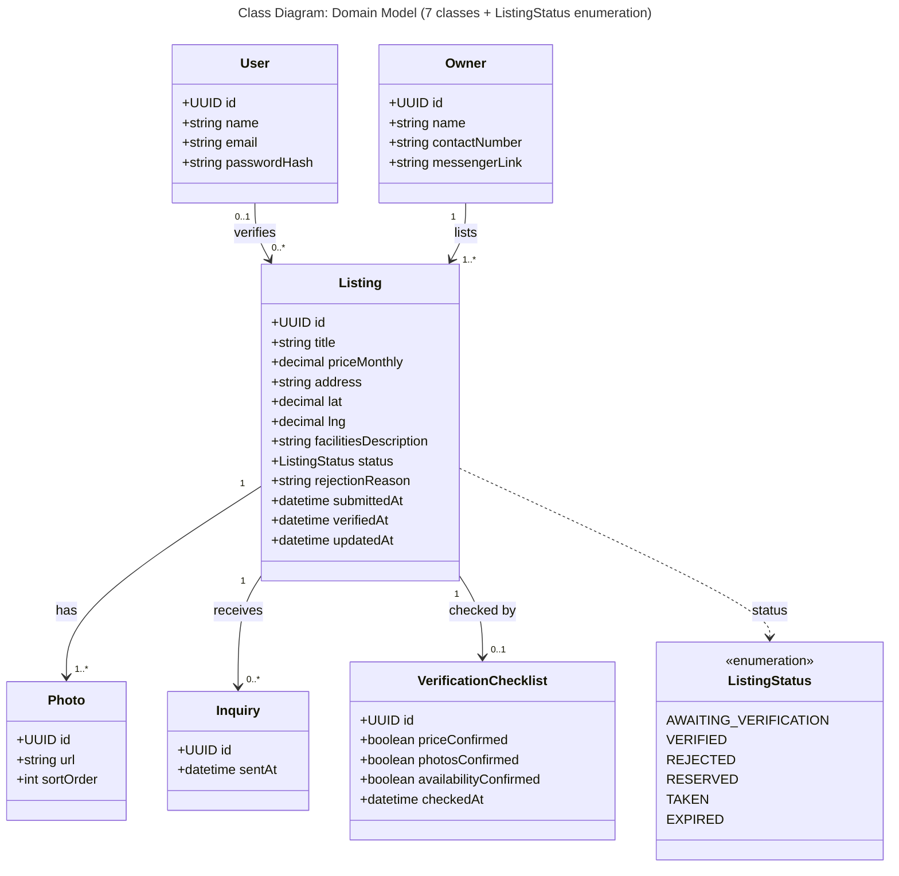

# Class Diagram — Boarding House Listing Verification Domain Model

**Scope:** 4–10 domain classes with typed attributes; multiplicity at both ends of every association; an enumeration for every status field.

**Key:** `+` = public attribute; `<<enumeration>>` = a fixed set of allowed values; `"1" --> "0..*"` reads as "one of the left side relates to zero or more of the right side"; dashed arrow = attribute typed by an enumeration.

**Traceability:** `VerificationChecklist` mirrors the check our Team Verifier performs (price, photos, availability). `Inquiry` is the class our JVB success metric counts. `ListingStatus` values are identical, letter for letter, to the state names in `state-machine.md`. `User "0..1"` is deliberate: a listing that is still AWAITING_VERIFICATION has no verifier yet. `rejectionReason` supports the "reason required" step in `activity.md`, and `updatedAt` supports the 14-day EXPIRED timeout in `state-machine.md`. `User` means a Team Verifier account; Owners and Students do not log in at MVP stage.
