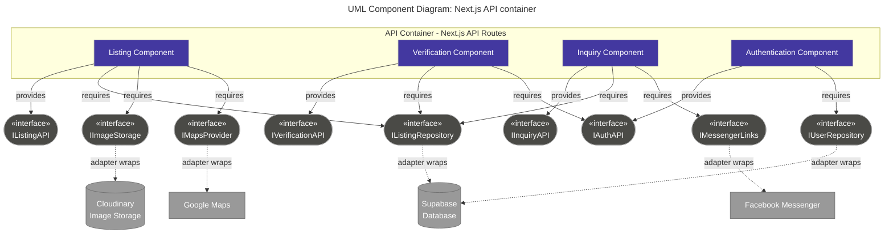

# UML Component Diagram — API Container

**Scope:** Our API container; the interfaces each component provides and requires; every external service kept behind an adapter interface.
 

**Key:** purple rectangles = components; grey rounded nodes = interfaces; solid arrows = provides / requires; dashed arrows = an adapter wrapping an external service, so no component talks to Supabase, Cloudinary, Google Maps, or Messenger directly.

**Traceability:** The five external dependencies match `containers.md` (Supabase, Cloudinary, Google Maps, Messenger). Keeping each behind its own interface means a future swap, such as replacing Cloudinary with Supabase Storage, only touches the adapter and not the Listing or Verification components. The Messenger adapter only builds the pre-filled chat link used in `sequence.md`.
