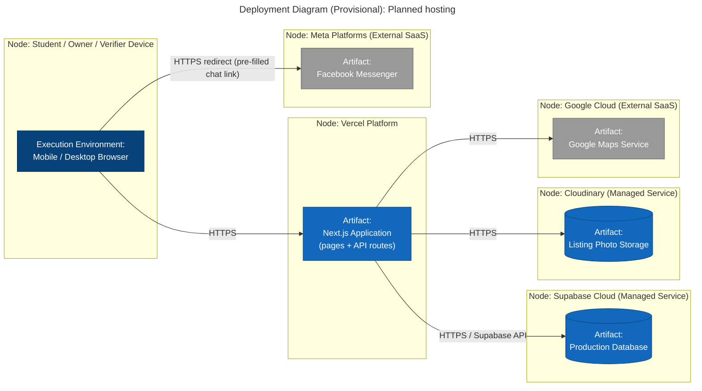

# Deployment Diagram — Provisional

**Scope:** Titled "Provisional"; nodes, execution environments, and artifacts; a protocol on every path; no secrets or real addresses.

**Key:** each outlined box is a node (a device or a cloud execution environment), read left to right as a request travels outward; the box or cylinder inside a node is the artifact (a deployed build or dataset) running there; blue = ours or managed for us, grey = external SaaS we do not control; every arrow carries its protocol.

**Why "Provisional":** we have not yet signed up for Vercel, Supabase, or Cloudinary accounts. These are our planned providers based on the Next.js stack, not confirmed infrastructure. No real hostnames, API keys, or connection strings appear here. The Messenger redirect starts from the student's browser, as in `sequence.md`.
