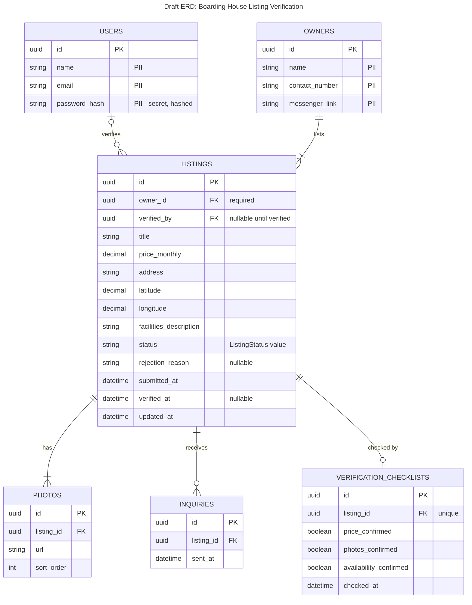

# Draft ERD — Boarding House Listing Verification

**Scope:** One table per stored class; primary and foreign keys; crow's-foot cardinality matching our class diagram; PII columns marked.

**Key:** crow's-foot notation: `||` = exactly one, `|o` / `o|` = zero or one, `o{` = zero or many, `|{` = one or many. A column commented `"PII"` holds personally identifiable information. `status` stores one of the six `ListingStatus` values from `class.md` (AWAITING_VERIFICATION, VERIFIED, REJECTED, RESERVED, TAKEN, EXPIRED).

**Cardinality check against class.md:** `USERS |o--o{ LISTINGS` matches `User "0..1" → Listing "0..*"` (a listing has no verifier until it is checked, so `verified_by` is nullable); `OWNERS ||--|{ LISTINGS` matches `Owner "1" → "1..*"`; `LISTINGS ||--|{ PHOTOS` matches `"1" → "1..*"`; `LISTINGS ||--o{ INQUIRIES` matches `"1" → "0..*"`; `LISTINGS ||--o| VERIFICATION_CHECKLISTS` matches `"1" → "0..1"`.

**PII note:** Student inquiries store no student identity (only listing and timestamp), so no student PII is kept. `address` is the property's address, not a person's home address, so it is not marked as PII.
