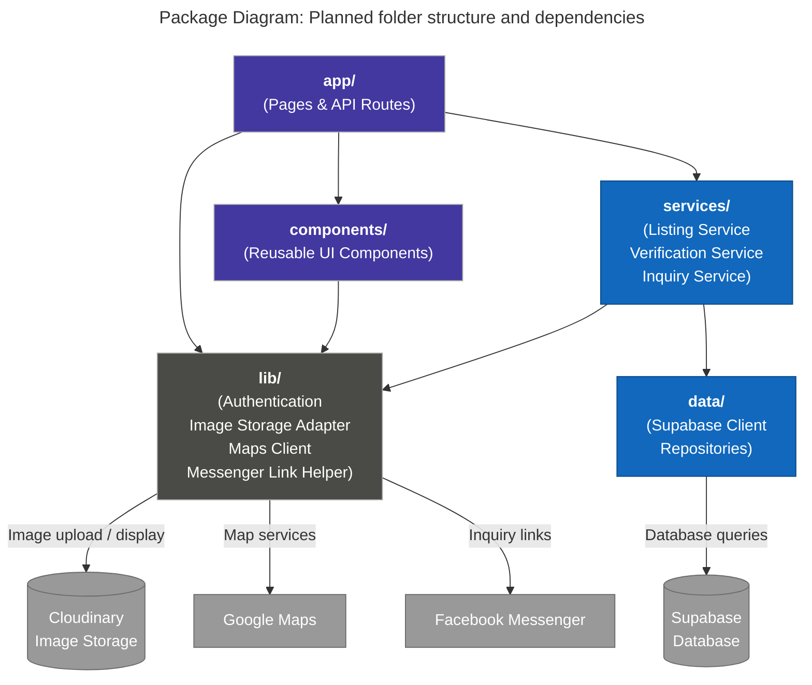

# Package Diagram — Folder Structure

**Scope:** The folder structure we will create; dependency arrows; one sentence stating our layering rule.

**Key:** arrows point from a package to the package it depends on (imports from); grey boxes and cylinders are external services, not folders.

**Layering rule:** Pages and API routes in `app/` never import `data/` directly; only `services/` may import `data/`, `components/` never imports `services/` or `data/`, and every external service except the database is reached only through `lib/`.
