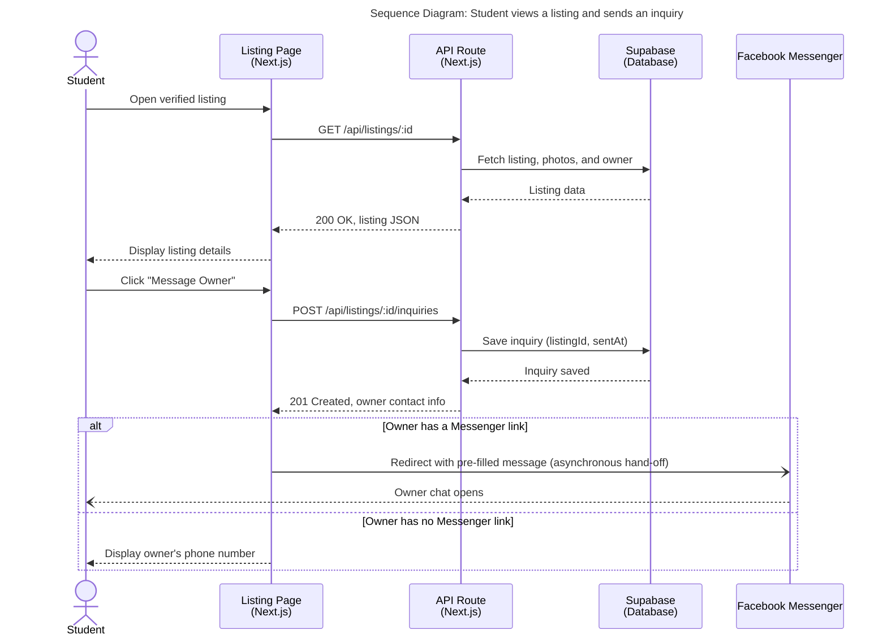

# Sequence Diagram — Student Views a Listing and Sends an Inquiry

**Scope:** Our riskiest flow (it is literally our JVB success metric); replies drawn; branches shown with alt; an external system (Facebook Messenger) as a lifeline.

**Key:** solid arrow with filled head = synchronous request; dashed arrow = reply; open-head arrow = asynchronous message (the browser hands the student over to Messenger and does not wait); `alt` / `else` = either-or branch.

**Why this is our riskiest flow:** every inquiry logged here is exactly what our JVB success criterion counts ("at least 15 of ~50 students message the post within 5 days"). If this flow breaks or undercounts, we cannot tell whether an experiment passed or failed. The inquiry is saved before the redirect, so it is counted even if the student never completes the Messenger chat.
