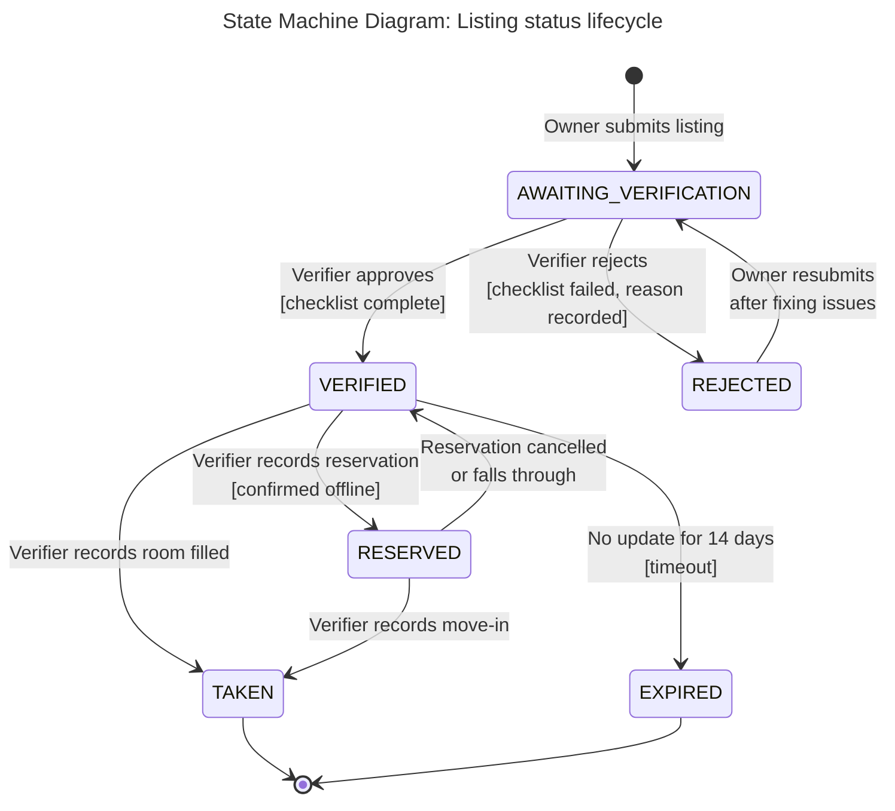

# State Machine Diagram — Listing Status
 
**Scope:** Our main entity (the object with a status field); initial and final states; states named as conditions; every transition labelled with its event.

**Key:** `[*]` = initial/final pseudo-state; arrow labels are the triggering event, bracketed text is the guard condition.

**Traceability:** These six state names are exactly the six values of the `ListingStatus` enumeration in `class.md`, and they are the values stored in the `status` column of `erd.md`. `AWAITING_VERIFICATION → VERIFIED / REJECTED` is the same decision drawn as the guarded branch in `activity.md`. Owners and students have no accounts at MVP stage, so every status change after submission is recorded by the Team Verifier (see "Update Listing Availability" in `use-cases.md`).
